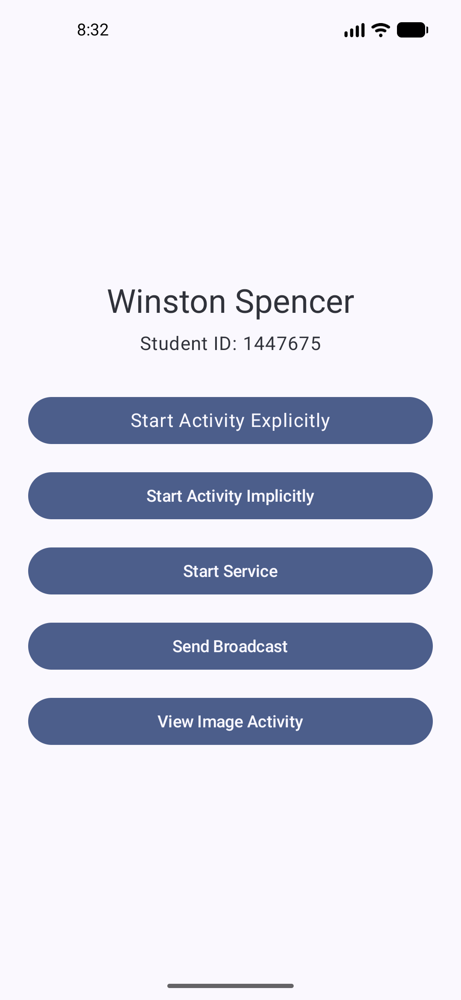
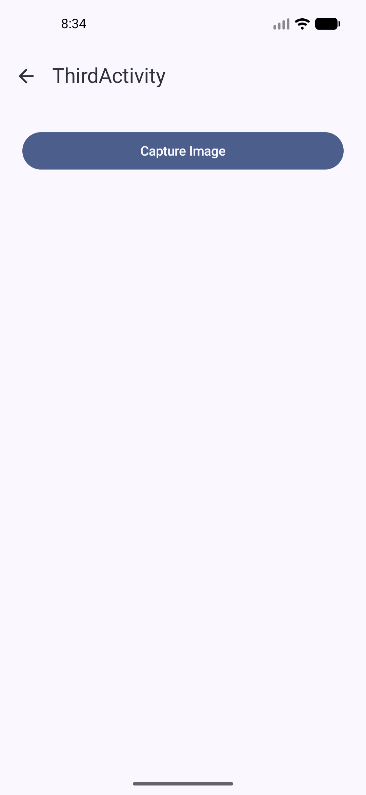
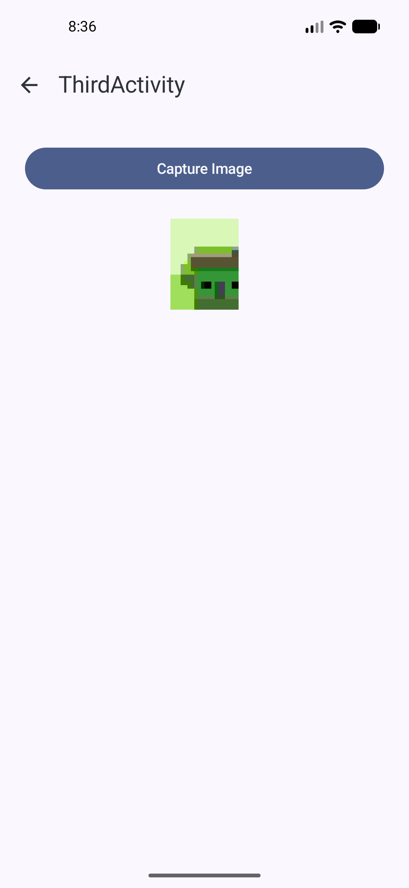

# Assignment 5 — Capture and Display an Image

## Screenshots

### Main Activity (with "View Image Activity" button)

### Third Activity (before capture)

### Camera

### Third Activity (captured image displayed)

---

## Screen Recording

[Assignment_5_Screen_recording.mp4](screenshots/assignment-5/Assignment_5_Screen_recording.mp4)

---

## Submission Links

- **GitHub repo:** https://github.com/winston-spencer/CS712AndroidApp.git
- **CS712AndroidApp commit link:** https://github.com/winston-spencer/CS712AndroidApp/commit/e502e03bb0f07d71838be1ad6c7cb02e7b65005d
- **Commit ID:** `e502e03bb0f07d71838be1ad6c7cb02e7b65005d`
